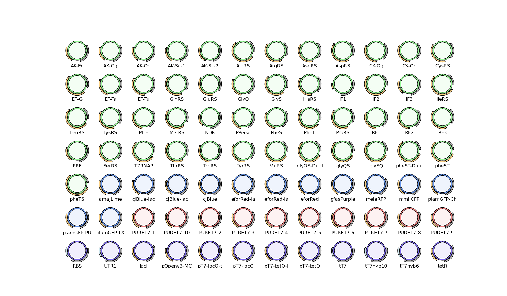

# Nucleus v0.1.0 DNA Distribution 
*open DNA for building synthetic cells*

The Nucleus DNA Distribution consists of 84 open source genetic constructs that can be used to engineer synthetic cells. The collection is part of the open source Nucleus synthetic cell package, which also includes protocols and tools for synthetic cell engineering that we validate will work together. Version 0.1 consists of a complete set of expression-ready genetic constructs that can be used to make the PURE system, a promoter set to tune protein expression, a reporter set for reproducible measurement of synthetic cells, and a basic set of open MoClo components for gene assembly.

PURE is a defined set of protein synthesis molecules now widely used as the core cytosol for synthetic cell engineering. While DNA distributions for making PURE already exist, they are challenging to use due to highly variable DNA architectures of component plasmids that have remained unchanged since their original development in 2001. These original designs are only available under the UBMTA, precluding easy reuse and redistribution. The only other available collection, the open-source PUREiodic Table Construction Kit, is not optimized for reliable production and is missing several essential components. The Nucleus v0.1.0 DNA collection contains a complete set of genes essential for producing and engineering PURE and includes variants of a subset of genes for further optimization and research.

The collection has been prepared under OpenMTA with Free Genes and the BioBricks Foundation.

# Contents
The distribution is broken into four categories: *PURE*, *Measurement Reporters*, *Modules*, and *MoClo*.

## PURE
These genes enable the production of the PURE cell-free system through the expression and purification of its constituent proteins. 50 plasmids encode the genes used in PURE. The genes are under the control of the pT7-lacO promoter—expression ready for protein production in *E. coli* T7 production strains (e.g., BL21(DE3) or NEB T7 Express). Each gene is tagged with either an N- or C-terminal 6xHistidine tag, in line with the tagging strategy used by Shimizu, *et al.* (2001) in their original paper describing PURE.

The constructs have been substantially upgraded from their original designs, incorporating improvements in DNA design and protein expression techniques:

- Consistent backbones, linkers, and other motifs.
- Dual terminator isolation to limit background expression.
- Direct expression from the original plasmid, but the ability to extract the gene as a MoClo part for use with different promoters, terminators, or tags, or assembly into a multiple-transcription-unit construct.
- Codon optimized for high expression in *E.* *coli*.
- Removal of relevant assembly restriction enzyme sites.

Several PURE genes are included as multiple variants. The adenylate kinase/myokinase (AK) gene is included as derived from *E. coli*, *S. cerevisiae*, chicken (*G. gallus*) and rabbit (*O. cuniculus*) sources, spanning those reported or included in other PURE DNA collections. Likewise, creatine kinase (CK) is included as derived from chicken and rabbit. The two heteromeric PURE tRNA synthetases, *glyRS* and *pheRS*, are included as standalone components for each subunit, as well as multigene transcription units in both gene orientations, reflecting differences between the original Shimizu and FreeGenes PUREiodic Table construct designs. A final, more highly engineered version of each synthetase is also included, with a histidine tag added to each complex subunit in order to improve protein purification efficiency.

## Measurement Reporters
Measurement reporters are included to produce comparable measurements of synthetic cells between labs and to provide visual controls for the protein purification steps involved in making PURE from the PURE gene set.

### Purification control reporters 
The purification control reporters include four chromoproteins, proteins which produce a visible color rather than (or, in some cases, as well as) fluorescence. The chromoproteins are gfasPurple, cjBlue, amajLime, and eforRed. CjBlue and eforRed are each available in multiple versions: a pT7 promoter for direct expression, a pT7-lacO promoter for determining the efficiency of lac repression, and a version with an N-terminal 6xHis tag under control of a pT7-lacO promoter to visually verify efficiency of protein purification.

### Level-matched T7 promoters
The level-matched T7 promoters are a set of 10 pT7 promoter variants, selected to allow for transcriptional control across two orders of magnitude, along the same lines as the Anderson Collection promoters for *E. coli*. The promoters are useful for implementing basic control in a synthetic cell, reducing the expression of toxic genes, and matching the stoichiometries of different proteins within multigene DNA constructs and synthetic cell modules.

Each promoter appears as a MoClo Level 0 ‘P’ part, while also driving expression of efasGFP for immediate use and measurement within PURE or cells containing the T7 RNA polymerase.

## Modules
Two inducible modules are included: lac repression, and tet repression. Each module includes a plasmid encoding the repressor protein, lacR and tetR respectively, as well as a reporter construct encoding efasGFP under control of the matching operator site. An integrated lac-tet reporter is also included, allowing for the expression of efasGFP in the presence of both IPTG and tetracycline—a simple AND gated reporter.

## MoClo
Several basic MoClo parts are included to facilitate the subcloning of other genes with alternative promoters, UTRs, and terminators. These parts also form a basis for developing a MoClo-compatible collection licensed under the OpenMTA.

The pOpen-MoClo-L1-1 vector is a modification of the FreeGenes pOpenv3 vector making it suitable as a MoClo level 1 destination plasmid. The vector contains an insert encoding J23103-UTR1-cjBlue, allowing for blue-white selection of correct assemblies.

Also included are two 5’ untranslated regions, UTR1 and the reference RBS from Elowitz (1999), and three terminators, tT7, tT7hyb6, and tT7hyb10. The UTR and terminator parts are designed as MoClo level 0 ‘U’ and ‘T’ modules, respectively.

UTR1 is based on the T7 *g10* leader sequence and results in highly efficient translation efficiency and consequent high expression levels in systems containing the *E. coli* ribosome. The Elowitz RBS is the reference RBS used to define RBS efficiency in Elowitz (1999) and by the iGEM community.

The T7 terminator tT7 is the consensus terminator derived from T7 *g1*, commonly used in protein production and recommended for use in the PURE system. T7hyb6 and T7hyb10 are efficient synthetic terminators developed by Calvopina-Chavez, *et al.* (2022) that have been shown to provide high termination efficiencies against T7 RNA polyermerase *in vivo* and *in vitro* as well as terminate transcription from the native *E. coli* RNA polymerase. The T7hyb6 terminator consists of a single termination domain while the more effective and longer T7hyb10 terminator consists of two termination domains linked by two pause sites.

# How do I use this distribution?
All DNA artifacts encoding proteins (i.e., the PURE set, and all fluorescent and colormetric reporters) include a T7 promoter and *******E. coli******* ribosome binding site, making them “expression ready”. Just transform these plasmids directly into a T7 RNAP expression system (e.g., BL21(DE3) cells) and go! 

All DNA artifacts are MoClo parts — you digest them with BsaI to generate standard MoClo overhang sites. You can then use Golden Gate assembly to assemble digested parts into a new DNA artifact. To learn more about MoClo, [read the original paper here](https://doi.org/10.1371/journal.pone.0016765).

# References
MoClo Paper - https://doi.org/10.1371/journal.pone.0016765
